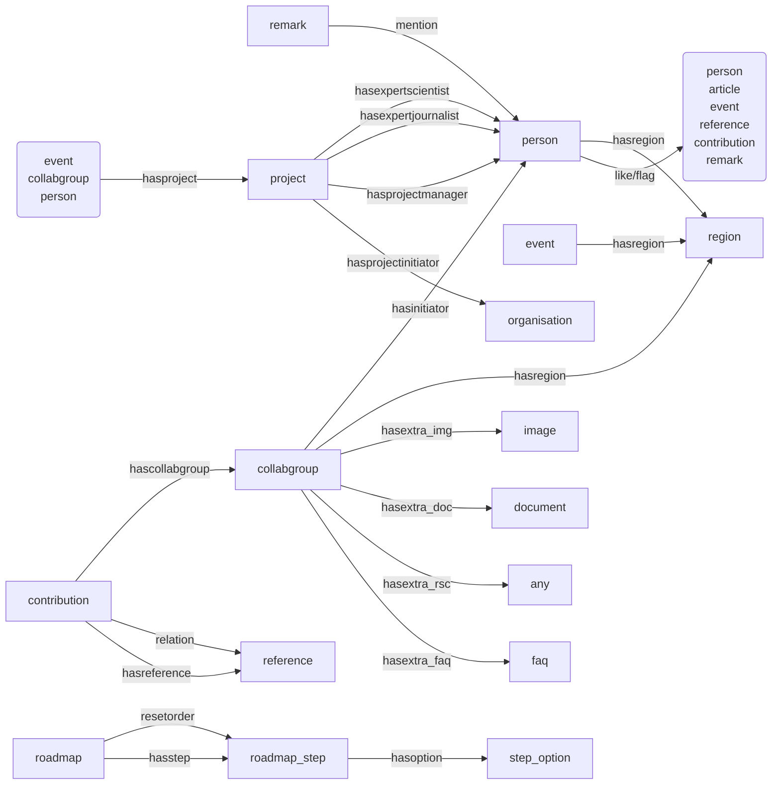
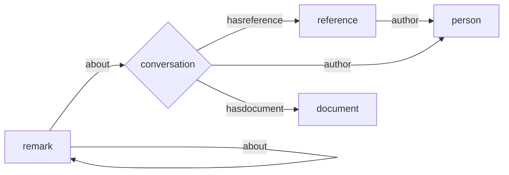
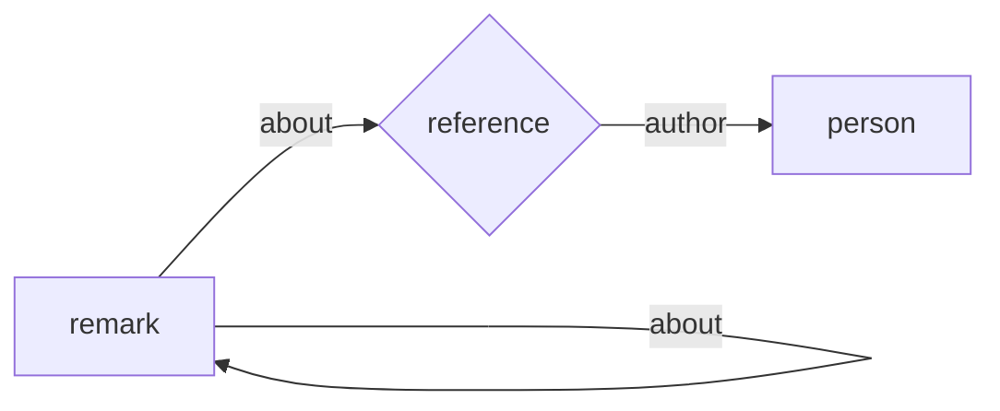
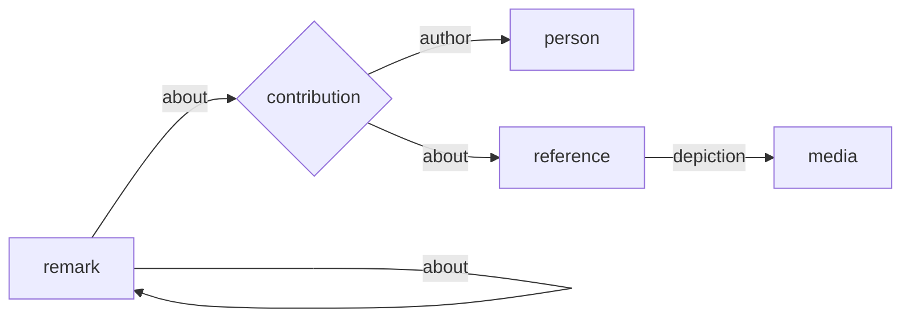
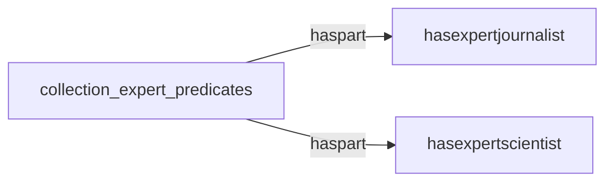

# KennisCloud

## Overview

The KennisCloud online platform provides a place to share (publish) insights, findings, questions
and start discussions on them. Users of the platform are librarians, journalists and other people
from media organisations, scientists and the general public, in particular visitors of public
libraries.

If you would like to contribute to this project make sure to review the [contribution policy](docs/CONTRIBUTION-POLICY.md) first.

### Stack

-   Frontend
    -   SCSS (css)
    -   Templating (html)
    -   [Elm](https://elm-lang.org/) (js)
-   Backend
    -   [Zotonic](https://zotonic.com/)
    -   Erlang

### Setup

To run this project and make contributions you will need to follow this checklist:

-   Clone [Zotonic](git@github.com:zotonic/zotonic.git) on your machine and build it
-   Clone this repository into the `zotonic/apps_user` directory
-   Install the frontend dependencies using the below instructions
    With nixOs:
    -   This project was built using [NixOs](https://nixos.org/) as a dependency management system via `nixpkgs`:
        -   Add this list of nixpkgs:
            -   sass
            -   uglify-js
            -   elm
            -   elm-format
            -   elm-analyse
            -   elm-test
            -   elm-upgrade
            -   elm-review
            -   go-task
        -   non-nix packages (these you will need to fetch from github or use another dependency management system):
            -   autprefixer
            -   breakpoint-sass
            -   normalize.css
        -   running `task` will compile all the frontend code

    Without nixOs:

    -   Using `npm`: (WIP)
        -   current version is set to v22.14.0.
        -   run `npm i` to install the frontend deps and task-go
        -   in the [`style.scss`](priv/lib-src/scss/src/style.scss) stylesheet replace the first 2 lines with the below commented out lines
        -   in the sass [Taskfile](priv/lib-src/scss/Taskfile.yml) uncomment the `npx sass` script and remove the `sass` lines above.
        -   run `task` to compile the stylesheets

**TODO:**

-   import the module stylsheets from ginger foundation into the repository

### Concepts

-   User groups
    -   Visitors (people without or with a temporary account)
        -   Not-logged-in visitors are regarded as being in the anonymous ("anoniem") user group
    -   Members (people with a KennisCloud account)
        -   The user group Members ("gebruikers") covers all logged-in users
    -   Community Librarians
        -   This user group includes editors ("redactie") and managers ("beheerders")
    -   Editors
    -   Managers
-   Regions
    -   Meetups, Knowledge groups and people can have regions
-   Meetups
    -   Meetups are events and have participants
-   Contributions
-   Discussions
    -   Discussions take place in the form of remarks on a contribution
-   Remarks
    -   A small message in response to a contribution or another remark
    -   Other KennisCloud members can be mentioned in a remark
    -   A remark can contain an image
-   Suggestions
    -   When adding contributions we would lookup library title suggestions
        (currently not used as the library API changed)
    -   When adding contributions we would lookup dbpedia suggestions
        (currently not used due to dbpedia server problems, we need to switch to the
        international one)
    -   When starting to type a mention in a remark, we lookup matching KennisCloud
        members
    -   When starting to type a keyword name when signing up, we lookup matches
-   Topics (keywords or tags)
    -   Topics can be added by editors or imported from library book title results
        (currently no new library keywords are imported because of API changes)
    -   Topics/keywords can be added to Locations (e.g. Regions), Knowledge groups,
        People, Media (Documents), Meetups, Text resources (e.g. Contributions,
        References, Remarks)
-   Knowledge groups ("Kennisgroepen" or collaboration groups)
    -   Discussion groups by topic where knowledge is collected in contributions and
        references
    -   Knowledge groups have initiators, members and managers
    -   They can be linked to a project and/or region
    -   Meetups are organised from a Knowledge Group
-   Projects
    -   Knowledge groups and people can be part of a project
-   Citizen science ("Burgerwetenschap")
-   Methodologies
-   Steps (within Methodologies)
-   Notifications
    -   When logged in, a user gets notified of mentions and contributions in their
        Knowledge Groups or in response of their own content via a notification icon
        in the top navigation bar
-   KennisCloud Weekly Update (newsletter)
    -   A newsletter is sent when there are new contributions in Knowledge groups
        subscribed to
-   KennisCrowds
    -   People participating in Meetups
-   Day Crowds
    -   A Day Crowd is a special Meetup that resets every night to cater for casual
        local ad hoc meetings, such as with people just happening to be at the LocHal

## Technology

-   KennisCloud is built on the Erlang (language) / OTP (middleware) system.
-   Nix is used to manage development environment dependencies.
-   Data is persisted to a Postgres database.
-   For building the project `task` is used (instead of `make`).

**TODO** Should we move back to `make` to reduce dependencies? At the moment "task" is somewhere in
our Nix dependencies, but it is not listed as a dep in Zotonic's `shell.nix` file, nor in a `shell.nix`
for the KennisCloud project. Currently we have it installed from Driebit's "dev-env" `shell.nix` as
`unstable-pkgs.go-task`.

## Development setup

1. Clone Zotonic
2. Ensure you can load the Nix environment (see shell.nix in the top-level directory of Zotonic)

The Nix environment includes Erlang, Postgres, image magick..

### Project installation and builds

1. Clone the Kenniscloud project (`master` branch) into the `apps_user` dir of Zotonic 1
2. Ensure that `zotonic_driebit_base` and `zotonic_driebit_edit` are also cloned inside the
   `apps_user` dir (`apps` is reserved for zotonic framework modules, all others should be in `apps_user`)
3. Run `make` in the Zotonic 1 root dir, to have Zotonic pick up the project
4. Start the site from the Zotonic site status page

Building project assets:

-   `task` to compile elm and scss
-   `task build-dev` to compile elm in debug mode so you can place debug statements. Scss will also compile.

### Modules

Module dependencies are listed in `priv/zotonic_site.config`.

#### KennisCloud specific modules

-   zotonic_mod_crowdlink
-   zotonic_mod_crowdparticipant
-   zotonic_mod_ginger_activity2

#### Zotonic module usage notes

This site uses the mod_access_url module to grant user access for a single request.
It is used for the implementation of one-click unsubscribe links.

1. `cd $PATH_TO_GINGER/modules`
2. `git clone git@github.com:mworrell/mod_access_url.git`

### KennisCloud support libraries

In the directory `src/support` you will find libraries to support the
implementation of functionalities and infrastructure, like:

-   Data schema and fixtures
-   Additional ACL rules
-   Batch operations
-   Weekly newsletter
-   Notifications
-   Working with activity streams (things that happen on the site)
-   Working with knowledge groups
-   Web references and suggestions
-   Integrations with services such as dbpedia (inactive at the moment) and
    public library services
-   Turtle format output (RDF/Linked Data)
-   Ordering Methodology Steps

### Fixtures

The fixtures in the `src/support/kenniscloud_schema.erl` file includes example
resources for development and testing, such as `person_community_librarian`.
These fixtures can be (re)installed by resetting the datamodel from the Zotonic
site status page `/admin/status`.

The user group of Community Librarians, as well as Project managers) should be a
subgroup of Members (and this is the case on production); this is taken care of
by the function `update_usergroup_hierarchy` in `kenniscloud_schema.erl`.

`Anonymous < Members < (Community Librarians, Project managers) < Editors < Managers < Administrator`

**TODO**: Is it actually correct that all Editors are also CL?
**TODO**: Is it still the case in Zotonic 1.x?

## Data model

-   The data model is defined in `src/support/kenniscloud_schema.erl` and extends
    the base Zotonic data model, as described in Zotonic's documentation.
-   Setting up user groups is part of the data model install procedure executed by
    a call to `manage_data(install, Context)`.
-   The installation of the data model covers (re)installing of project specific
    `modules`, setting default configuration values, setting up parts of the site
    depending on environment (production, acceptance, test, development) and
    initialising the Zotonic `#datamodel` with `categories`, `resources`, `edges`,
    `predicates` and `media`. For an explanation of datamodel concepts, see
    https://zotonic.com/docs/1277/the-zotonic-data-model

### Special resources

-   Footer menu
-   Community librarian usergroup
-   Project manager usergroup
-   Regions (including a `region_none`)
-   DCAT Datasets on regions, knowledge groups (collabgroups), meetups,
    references, contributions, remarks
-   Methodology resources
-   Roadmap resources
-   Avatar fallback image

### Special pages

-   Homepage `page_home` (collection)
-   Samenwerking VU, OBA en de Waag `vpro_waag_collaboration` (text)
-   About image rights `page_image_copyright` (text)

### KennisCloud specific categories

-   Reference ("bron", is a text)
-   Contribution (is a text)
-   Task (is a contribution)
-   Anonymous participant (is a person)
-   Remark ("opmerking", is a text)
-   Frequently asked question (is a text)
-   Region (is a location)
-   Library keyword (is a keyword)
-   DCAT dataset (is a query)
-   Roadmap
-   Roadmap step
-   Step option
-   Project
-   Organisation
-   Day crowd event (is a Meetup)

#### Zotonic categories with specific use

-   Knowledge group (=acl_collaboration_group)
-   Meetup (=event)

### KennisCloud specific predicates

### Zotonic predicates with specific use in KennisCloud

-   Meetup attendance through the Zotonic `rsvp` predicate from members to events.

### Data relations kept outside of Zotonic resources

#### Crowd links

A table `crowdlink` links to Meetups via a `crowd_id` (= event rsc id),
providing an expiring Meetup Crowd view `url`.

The table is managed from the `m_crowdlink` model inside the
`zotonic_mod_crowdlink` module.

#### Crowd participants

A table `crowdparticipant` provides an expiring link between a person and a
Meetup crowd via `person_id` and `crowd_id` (= event rsc id). The link also
carries `name`, `email` and `show_contact` information, which will expire with
the whole record to facilitate temporarily and only in-crowd sharing of personal
data. After expiration only an anonymous user (person) resource remains.

The table is managed from the `m_crowdparticipant` model inside the
`zotonic_mod_crowdparticipant` module.

### Model of contributions

#### Conversations (former category of contributions)

#### References

#### Contributions model

References can't be created by themselves; they are part of contributions (former conversations)

## User rights (authorisation)

(?) Manually set in production admin
(K) Set by the kenniscloud project
(G) Set by module Ginger Base

### Guest (Gast)

-   View all
-   Create account, start enrollment

### Member (Lid)

-   Frontend edit
-   Allowed use of modules: `mod_ginger_edit` (K), `mod_ginger_rdf` (K)
-   Edit profile
-   Join a knowledge group
-   Create topics (contributions and meetups)
-   Can edit posts (but not delete!)
-   Post a comment

### Knowledge group administrator (Kennisgroep beheerder)

-   Frontend edit
-   Give permissions to: Log in as user
-   Must have a white flag next to his/her profile picture
-   Must have description 'knowledge group manager' in quick profile view
-   Must be shown second in people overview (after CL)
-   **Does not exist anymore (???)**

### Project leader/manager (Projectleider)

-   Admin edit
-   Allowed use of modules: `mod_admin` (K)
-   Editing projects they are project leader of
-   Editing knowledge groups of projects are project leader of
-   View, create, edit, delete, link content in own content groups (is_owner)
-   View, create, edit, delete, link own content groups (is_owner)
-   Create knowledge groups
-   Link, unlink and edit members (person) (temporary too broad rule)
-   Adding and editing tags

### Community Librarian

-   Allowed use of modules: `mod_admin` (K), `mod_acl_user_groups` (K), `mod_content_groups` (?), `mod_admin_identity` (K)
-   Admin edit
-   Create knowledge group
-   Edit own knowledge group
-   Manage own knowledge group members
-   Remove/edit contributions
-   Can add tags
-   Add/remove knowledge group administrators (multiple administrators possible)
-   Set username/password for users
-   Place people in the correct user group(s)
-   Must have an orange flag next to their profile picture
-   Must have the description 'community librarian' in the quick profile view
-   Must be shown first in the people overview.

### REDACTEUR

-   Allowed use modules: `mod_admin` (G), `mod_menu` (G+K), `mod_seo` (K)
-   Delete knowledge groups
-   Create Community Librarians
-   Adjust all texts on all pages.
-   Add general pages
-   Create/adjust choice & order of knowledge groups on homepage

## Sign-up flow

The following flow chart shows how sign-up works:

## Start new collaboration group mailto links

The mailto links of the "Start new collaboration group" buttons are configured depending on
the resource category of the containing page:

-   For Regions: the `email` property of the region resource is inserted as mail destination
-   For the collaboration groups overview page: the email field of the community librarian
    user group is used `acl_user_group_community_librarian.email`

## Newsletter

The automatically generated weekly newsletter consists of the following parts:

-   Header with headlines from news (`short_title`)
-   Logo and mailheader image
-   Salutation personalised with the receiver's first name (`name_first`) if present
    (defaults to `title`)
-   A list of news (`news`)
-   A list of updates (`contributions`)
-   Highlighteds: next meetup (`meetup_next`) and upcoming meetup (next month,
    `meetup_upcoming`)
-   Footer with unsubscribe link

and is compiled from content satisfying the following criteria:

-   News (`news`):
    -   The 3 top items of a maximum of 3 knowledge groups (e.g. if you are member of
        2 groups and group 1 has 2, and group 2 3 items, the news list will consist
        of item 1 of group 1, item 1 of group 2, and item 2 of group 1)
    -   From a maximum of 3 news items each per knowledge group
    -   Resources of category `news`
    -   From the default content group `default_content_group` and knowledge groups
        the receiver is subscribed to
    -   Sorted descending on `publication_start`
    -   where `publication_start` is between (and including) today and 6 days ago
    -   News items created by the recipient are _not excluded_
-   Updates (`contributions`):
    -   The top 3 items of a maximum of 3 knowledge groups (see News)
    -   Resource created less than 7 days ago of any category except remarks
    -   Resources created by the recipient are excluded
-   Next meetup (`meetup_next`):
    -   First (starting from the next day, up to and including 7 days ahead) based
        on `date_start` within all regions of the recipient
    -   Resources of category `event`
    -   Events created by the recipient are excluded
-   Upcoming meetup (`meetup_upcoming`):
    -   First (starting 25 days ahead, up to and including 31 days ahead) based on
        `date_start` within all regions of the recipient
    -   Resources of category `event`
    -   Events created by the recipient are excluded

## Knowledge groups (kennisgroepen)

-   Knowledge groups (category unique name `acl_collaboration_group`) are
    collaboration groups
-   See https://zotonic.com/docs/1752/mod_acl_user_groups and (rationale)
    https://github.com/zotonic/zotonic/issues/1099
-   Collaboration groups have members and managers, with their own acl rules
-   The content group of a knowledge (collaboration) group is itself
-   KennisCloud members who are linked to a knowledge group using the
    `collabmember` or `collabmanager` predicate are _knowledge group member_
-   Previously, project managers (project leaders) and project experts (journalists
    and scientists) were shown as participating in all knowledge groups linked to
    their projects, but **this is not the case anymore**: they have to be a member
    or manager of the knowledge group to get listed.
    -   `Collabgroup -> hasproject -> Project -> hasprojectmanager -> Person`
    -   `Collabgroup -> hasproject -> Project -> hasexpertjournalist -> Person`
    -   `Collabgroup -> hasproject -> Project -> hasexpertscientist -> Person`

## Projects

In context of the integration of for example the 'Burgerwetenschap' project.

### Project managers

Link to project with `hasprojectmanager`. Using `hascollabmanager` creates a
higher risk of confusion.

### Projects

Projects are used to bundle multiple collaboration groups within a project topic
and community.

-   The project page design looks a lot like the landing page of a region
-   Projects are not region specific (yet)
-   Can span multiple collaboration groups

Projects are initiated by a collaboration of organisations.
At the moment, organisations are separate entities connected to projects via the `hasprojectinitiator` predicate.

However, there is also supposed to be a page describing the collaboration between the organisations.
At the moment, there is just one hardcoded page for the collaboration between VU, OBA, and Waag Futurelab.
In the future, we want to change this by replacing the "Organisation" category with a "Collaboration" category.
Collaborations will hold the logo's of the organisations and describe the collaborations.
They could be connected to projects via a `has_initiating_collaboration` predicate.

### Journalists and scientists, and the data model

Journalists and scientists are specialists/experts whose recognised roles should be visible
within projects.

Edges:

-   `Project` `hasexpertjournalist` `Person`
-   `Project` `hasexpertscientist` `Person`
-   `Project` `hasprojectmanager` `Person`
-   `Project` `hasprojectinitiator` `Organisation`
